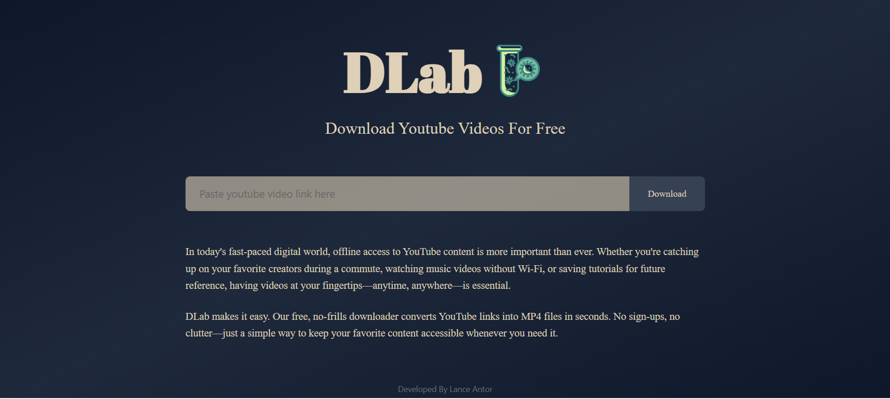
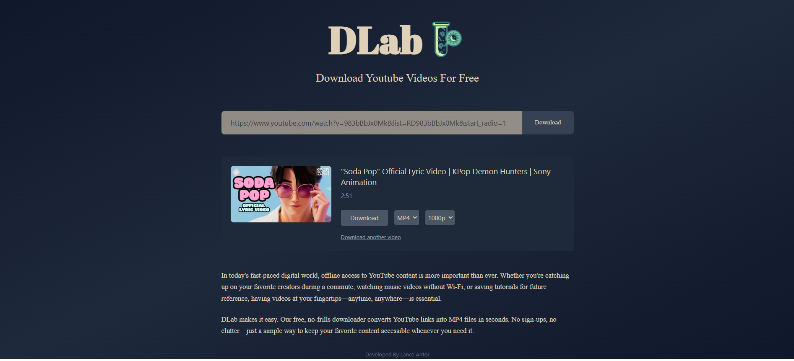

# DLab

⚠️ **STRICT LEGAL NOTICE & TERMS OF USE**

**THIS SOFTWARE IS FOR EDUCATIONAL AND RESEARCH PURPOSES ONLY**

By downloading, installing, or using this software, you explicitly agree to the following terms:

### PROHIBITED USES
- **Downloading copyrighted content without explicit written permission**
- **Commercial use of any downloaded content**
- **Violating YouTube's Terms of Service or any third-party platform policies**
- **Mass downloading, automated scraping, or bulk content extraction**
- **Distribution of downloaded copyrighted material**

### USER RESPONSIBILITIES
Users are **solely responsible** for:
- Complying with YouTube's Terms of Service and API guidelines
- Respecting all applicable copyright laws and regulations in their jurisdiction
- Obtaining proper written permissions before downloading any content
- Using this tool only with content they legally own or have explicit authorization to download
- Ensuring compliance with DMCA and international copyright treaties

### ACCEPTABLE USE POLICY
This tool may **ONLY** be used for:
- **Educational purposes** and learning full-stack development
- **Personal backup** of your own uploaded content
- **Content you have created** and own the rights to
- **Public domain or Creative Commons licensed content** (with proper attribution)
- **Technical demonstration** of web development concepts

### DISCLAIMER OF LIABILITY
- This software is provided **"AS IS"** without warranty of any kind, express or implied
- **The developers assume NO liability** for any misuse, legal consequences, or damages
- **Users assume FULL legal responsibility** for their actions and compliance with applicable laws
- **The developers explicitly DO NOT condone, encourage, or support copyright infringement**
- This tool is a **technical demonstration only** and not intended for production use

### INDEMNIFICATION
By using this software, you agree to **indemnify and hold harmless** the developers from any claims, damages, losses, or legal expenses arising from your use of this software.

### TERMINATION
The developers reserve the right to discontinue this project at any time if it is used in violation of these terms or applicable laws.

**If you do not agree to these terms, DO NOT use this software.**

---

DLab is a comprehensive full-stack application demonstrating modern web development techniques with React frontend and Node.js backend. This project showcases advanced development patterns, API integration, real-time data processing, and serves as an educational resource for learning full-stack development concepts.

## 🎓 Educational Purpose

This project is designed as a **learning tool** for developers interested in:
- Full-stack JavaScript development
- React and Node.js integration
- Real-time progress tracking implementation
- Modern web application architecture
- API design and implementation

## Visual Demo

### Home Screen

*DLab home screen demonstrating modern UI design*

### Application Interface

*Interface showing real-time progress tracking and modern web development techniques*

## Features

- **Full-Stack Architecture**: Complete frontend and backend integration with seamless communication
- **Modern Development Patterns**: Demonstrates current best practices in web development
- **Real-time Progress Tracking**: Live progress updates with visual feedback
- **Responsive UI**: Clean, modern React interface with intuitive controls
- **API Integration**: RESTful API design and implementation
- **Cross-Platform Compatibility**: Works on Windows, macOS, and Linux
- **Development Tools**: Comprehensive development environment setup

## Installation

```bash
# Clone the repository
git clone https://github.com/yourusername/DLab.git
cd DLab

# Install frontend dependencies
npm install

# Install backend dependencies
cd backend
npm install
cd ..
```

## Quick Start

### Windows Users
Simply run the launcher script:
```cmd
start-dlab.bat
```
This will automatically start both frontend and backend servers.

### Manual Start
```bash
# Start backend server (in one terminal)
cd backend
node server.js

# Start frontend development server (in another terminal)
npm run dev
```

## Usage

⚠️ **REMINDER**: This tool is for educational purposes only. Ensure compliance with all applicable laws and terms of service.

- **Start Application**: Run `start-dlab.bat` or manually start both servers
- **Access Interface**: Navigate to `http://localhost:5173` in your browser
- **Educational Use**: Explore the codebase to understand full-stack development concepts
- **Local Development**: Use as a learning resource for modern web development techniques

## Project Structure

```
DLab/
├── backend/                 # Node.js Express server
│   ├── server.js           # Main server file
│   └── package.json        # Backend dependencies
├── src/                    # React frontend source
│   ├── components/         # React components
│   ├── assets/            # Images, icons, etc.
│   └── ...
├── start-dlab.bat         # Windows launcher script
├── package.json           # Frontend dependencies
└── README.md              # This file
```

## Built With

- 
- 
- 
- 
- 
- 

## Server Configuration

- **Frontend Server**: Runs on `http://localhost:5173` (Vite development server)
- **Backend Server**: Runs on `http://localhost:3001` (Express.js API server)
- **Local Development**: Both servers designed for educational and development use only

## Development Learning Objectives

This project teaches:
- Modern React development with hooks and context
- Node.js and Express.js backend architecture
- Real-time communication between frontend and backend
- File handling and progress tracking
- Modern build tools and development workflows
- API design and RESTful principles

## Acknowledgements

- **[Express.js](https://expressjs.com/)**: Fast, unopinionated web framework for Node.js
- **[Vite](https://vitejs.dev/)**: Next generation frontend tooling
- **[React](https://reactjs.org/)**: A JavaScript library for building user interfaces
- **[Node.js](https://nodejs.org/)**: JavaScript runtime for server-side development
- **Open Source Community**: For providing educational resources and development tools

## Development

```bash
# Frontend development
npm run dev

# Backend development
cd backend
npm run dev

# Build for production (educational/portfolio use only)
npm run build
```

## Legal Compliance & Contact

- **Educational Use Only**: This tool is intended solely for learning full-stack development
- **User Responsibility**: Users must comply with all applicable laws and terms of service
- **No Production Use**: This software is not intended for production or commercial use
- **Copyright Respect**: Always obtain proper permissions before processing any content
- **Questions**: For legal compliance questions, contact [your-email@example.com]

## License

This project is provided for educational purposes only. Users are responsible for ensuring their use complies with all applicable laws and terms of service.

---

&copy; 2025 DLab. All rights reserved. Educational use only.
